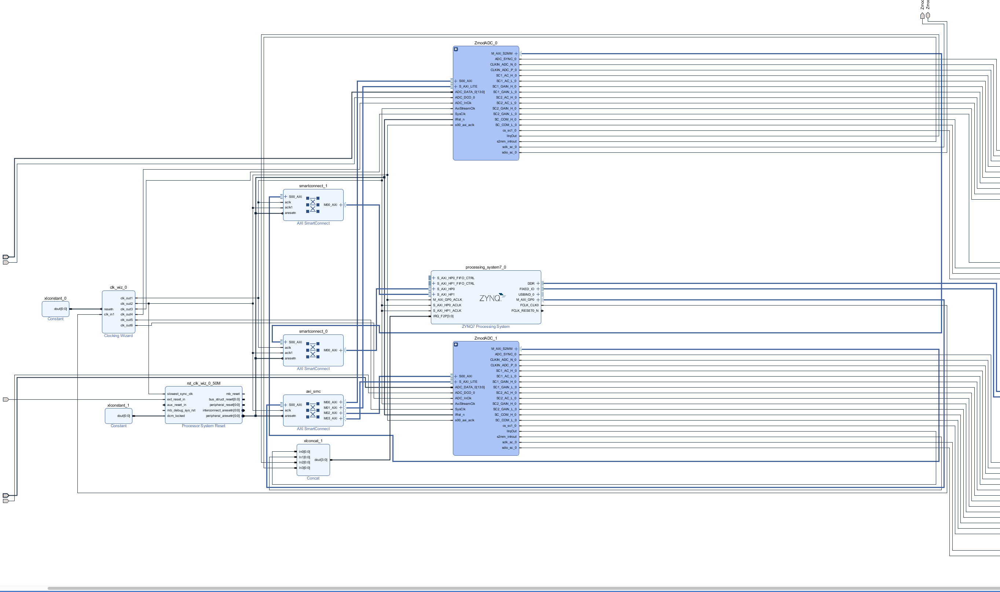
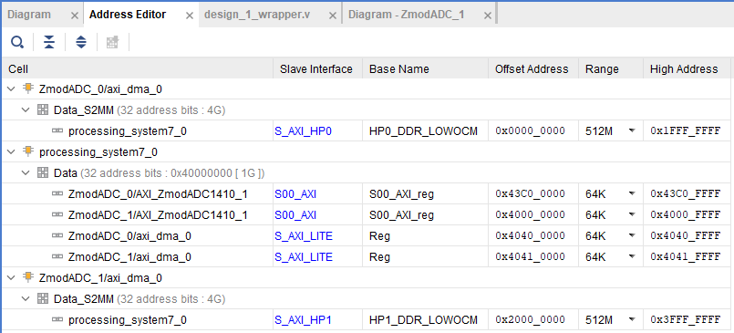

# eclypse_z7_adc_adc_linux
A suite of tools, libraries and projects used to get dual ZMOD adcs as linux devices on the Eclypse Z7 Platform


## Table of Contents
- [docker-petalinux](#docker-petalinux)
    - docker build for petalinux with xilinx 2019.1, which was used to create the hardware.
- [Eclypse-Z7-HW](#eclypse-z7-hw)
    - A fork of the Eclypse-Z7-HW repo with a zmod_adc_adc/master branch containing the hardware project files for the dual adc setup.
- [Eclypse-Z7-OS](#eclypse-z7-os)
    - A fork of the Eclypse-Z7-OS repo with a zmod_adc_adc/master branch containing the petalinux build project for the above hardware project.
- [py_ez7_udmabuf](#py-ez7-udmabuf)
    - Source for python bindings that can be used to interact with the zmod adcs. Mostly copied from [miyo's py_eclypse_z7 project](https://github.com/miyo/py_eclypse_z7/tree/main) with alterations to use u-dma-buf instead of the xilinx axidma drivers, as the axidma drivers do not allow us to use two AXI with seperate dma ranges.

## Hardware Description
 The primary goal of this project was to be able to read simultaneously from both ADCs. Some modifications to the original design by Digilent had to be made to facilitate this. 

Below we have the block diagram for our hardware. Things to note are the usage of two sepeate AXI lines. This sepeareates both adcs so they can write simultaneously and so we can recieve signals like buffer full or transfer complete from each adc individually.


Below is the address editor for our hardware. Here we descretely split our 1G memory space into two seperate 512 Mb regions so that they do not step on eachother.


## Operating System Description
The main caveate with our operating system design is that xilinx's axidma driver does not support multiple AXI lines. While i'm not sure the internal reason for why this is designed the way it is, the reason for only one AXI line being operable is that the dma buffer space used is allocated by the system, giving it a random address in memory. Since we split our buffer ranges into two, one ADC's buffer will be outside of its DMA range. 

To solve this, we add the [u-dma-buf](https://github.com/ikwzm/udmabuf) kernel module as a bitbake recipe. This kernel module allows us to statically define dma buffer memory regions in our device tree and access them through user space devices like `/dev/udmabuf0`.

If you look at the [system-user.dtsi](https://github.com/dannyp303/Eclypse-Z7-OS/project-spec/meta-user/recipes-bsp/device-tree/files/system-user.dtsi) you can see these nodes:
```
        dma0_buffer: dma0_buffer@10000000 {
            reg = <0x10000000 0x00100000>; // 1 MB at 256 MB
            no-map;
            compatible = "shared-dma-pool";
        };

        dma1_buffer: dma1_buffer@30000000 {
            reg = <0x30000000 0x00100000>; // 1 MB at 768 MB
            no-map;
            compatible = "shared-dma-pool";
        };
```
and
```
    udmabuf0: udmabuf@0 {
        compatible = "ikwzm,u-dma-buf";
        memory-region = <&dma0_buffer>;
        size = <0x00100000>;
        device-name = "udmabuf0";
    };

    udmabuf1: udmabuf@1 {
        compatible = "ikwzm,u-dma-buf";
        memory-region = <&dma1_buffer>;
        size = <0x00100000>;
        device-name = "udmabuf1";
    };
```
The first block defines the locations and sizes of the dma buffers. Notice that each is within the AXI DMA range defined in Vivado's address editor. These sizes are adjustable up to 512MB as defined in the address editor. The next nodes define the linux character devices used by the user to access these dma locations. 

In order to adjust location and size of the DMA buffers, we must rebuild the DTB via the command `petalinux-build -c device-tree` in our OS build, then drop it onto the device.

## Cross Compiling for the Eclypse Z7
It is highly recommended to cross compile all user space code for the eclypse in a crossenv in petalinux using the SDK for your build.

### Building an Image
After you have followed the instructions in the [docker-petalinux](#docker-petalinux) repo and have a working petalinux container, we can use these steps to build our image.
1. Use `docker cp` to copy your [Eclypse-Z7-OS](#eclypse-z7-os) repo into the container. 
2. Inside the container and inside the copied repo run `petalinux-build`.
3. After the build is complete, run `petalinux-build -c device-tree -x clean && petalinux-build && petalinux-package --boot   --fsbl images/linux/zynq_fsbl.elf   --fpga ../design_1_wrapper_hw_platform_0/design_1_wrapper.bit   --u-boot --force`
4. Copy out `images/linux` from the root of the repo, this is your image. 

### Updating the device.
Now that we have our image files from the `images/linux` directory, we can follow these steps to update the device.
1. Prepare an SD card with the [Digilent v0.3 Debian image](https://github.com/Digilent/Eclypse-Z7/releases/tag/v0.3).
2. Copy `BOOT.BIN`, `system.bit`, `system.dtb`, and `image.ub` from the `images/linux` directory into the `boot` partition of the SD card, replacing the existing files. 
3. Open `uEnv.txt` in the `boot` partition and change 
    ```
    setenv bit_name zm-${zmod}.bit; \
    setenv dtb_name zm-${zmod}.dtb; \
    ```

    to 

    ```
    setenv bit_name system.bit; \
    setenv dtb_name system.dtb; \
    ```
    Alternatively, copy your `system.bit` and `system.dtb` to `zm-adc-adc.bit` and `zm-adc-adc.dtb` and change this line
    ```
    zmod=adc
    ```
    to
    ```
    zmod=adc-adc
    ```
4. We should also change your MAC address inside the uEnv.txt if we have multiple Eclypse Z7s on the network. To set the MAC add something like this to the uEnv.txt.
```
ethaddr=00:0a:35:00:1e:54
``` 
5. Your SD card should now boot to have `/dev/uio0`, `/dev/uio1`, `/dev/udmabuf0` and `/dev/udmabuf1`.

### Release Image
There is a [release image](https://github.com/dannyp303/eclypse_z7_adc_adc_linux/releases/tag/release-image) available that can be burned to an SD card and used with all of the features in this repo immediately.

### Crossenv setup
1. First we have to build the sdk. To do this, after building your image with `petalinux-build` we run `petalinux-build --sdk`.
2. After we have our sdk, we source the sdk env with `source /opt/petalinux-sdk/environment-setup-cortexa9t2hf-neon-xilinx-linux-gnueabi`
3. Make sure you have the same python version you are going to install installed in the petalinux build system. 
    - The recommended way to do this is to build from source natively first inside the build system, then build the same source in the cross env.
4. Build the cross env with `python3 -m crossenv /path/to/host/python3.11 /path/to/crossenv-dir`
5. Activate the crossenv with `source /path/to/crossenv-dir/bin/activate`
6. Set your environment variables used in compilation to match the sdk like so:
    ```
    export CC=arm-linux-gnueabihf-gcc
    export CXX=arm-linux-gnueabihf-g++
    export AR=arm-linux-gnueabihf-ar
    export RANLIB=arm-linux-gnueabihf-ranlib
    export READELF=arm-linux-gnueabihf-readelf
    export STRIP=arm-linux-gnueabihf-strip
    export SYSROOT=/opt/petalinux-sdk/sysroots/cortexa9t2hf-neon-xilinx-linux-gnueabi
    export CFLAGS="--sysroot=$SYSROOT"
    export LDFLAGS="--sysroot=$SYSROOT"
    ```
7. Use `file` to make sure your programs are ARM executables.
8. Compile or even pip install the packages you need, compress them, and send them to your Eclypse-Z7 to be used.
